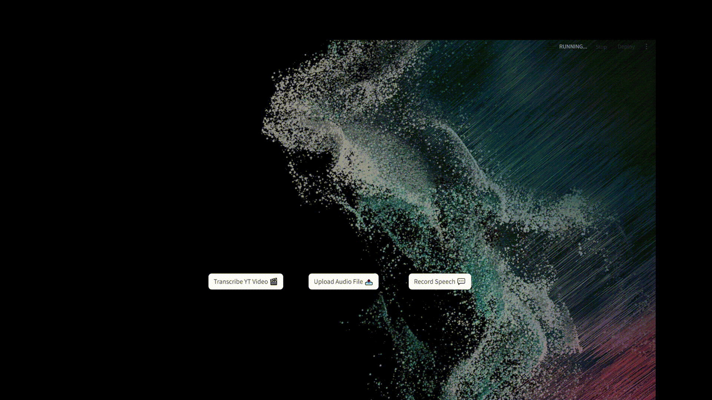

# voXify

## Foreword
Welcome to the **voXify** repository, a web application powered by Streamlit. **voXify** provides a comprehensive suite of Speech-to-Text functionalities, facilitating the generation of transcripts from diverse audio sources.allowing users to obtain transcripts from various audio sources. For tasks encompassing the extraction of text from a YouTube video, uploading an audio file, or capturing live speech, **voXify**  offers a seamless solution to generate the corresponding transcript and visualize it onto the plateform. Your transcript can finally be conveniently downloaded in either PDF or Word format.

## Main Features
- **YouTube Transcription 🎬**
vo**X**ify offers the ability to convert any YouTube video into text, leveraging `pytube` library as well as [Whisper](https://github.com/openai/whisper), OpenAI's open-source speech-to-text model.

- **Audio File Transcription 📤**
Transcribe audio files of various formats (WAV, MP3, M4A, MP4, MPEG4) into text by simply uploading them through the file uploader widget provided for this purpose.

- **Real-time Microphone Transcription 💬**
Obtain live transcriptions directly from your microphone. voXify captures speech in real-time and provides a simultaneous display of both the transcript and the relate soundwave.

### Overview of the Repository
- `layout/`: This directory contains the HTML template file (`index.html`) and the CSS styling file (`styles.css`) used for the design of the user interface.
- `.streamlit/`: Comprises the custom `config.toml` file that sets tailored configuration options to optimize the functioning of the application.
- `utils/`: This directory houses essential Python functions and classes that are utilized throughout the application for various tasks such as data processing, interaction with APIs, or other utility functions.
- `ffmpeg.exe`: This executable file is necessary for the live speech-to-text functionality, enabling real-time conversion of spoken words to text within the application.
- `main.py`: This Python script serves as the main entry point for the application, containing the core functionality and orchestrating the overall layout and behavior of the application. It handles routing, data processing, user interactions, and integration with external services or libraries.